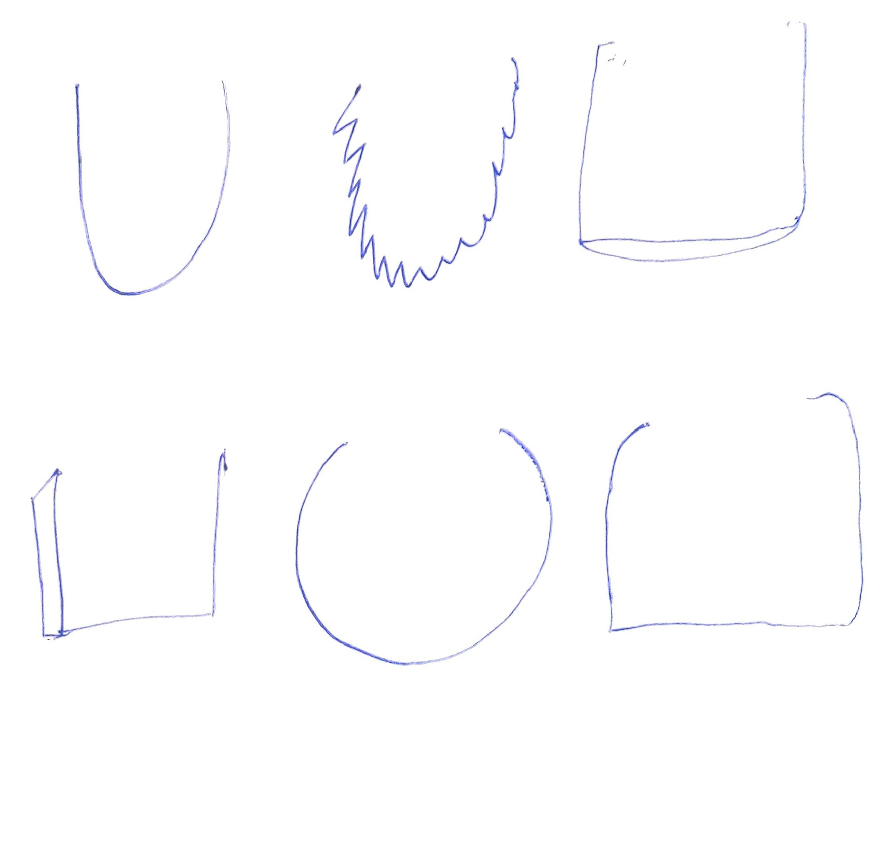
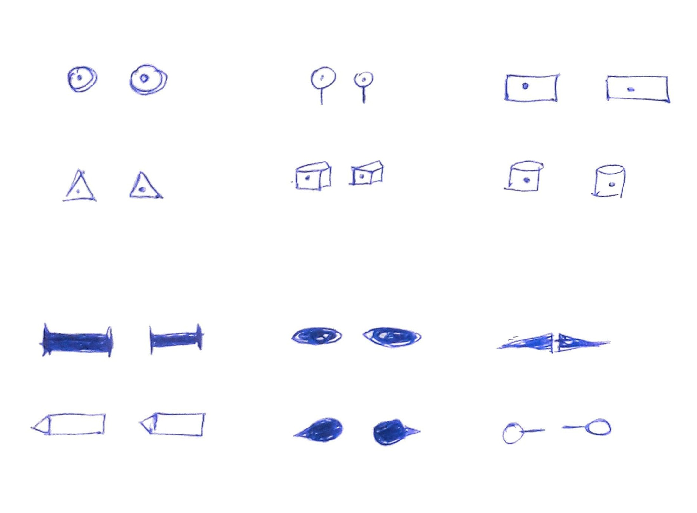
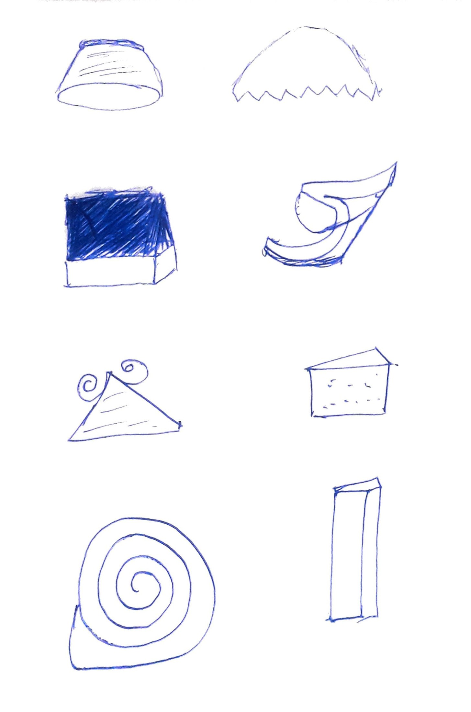
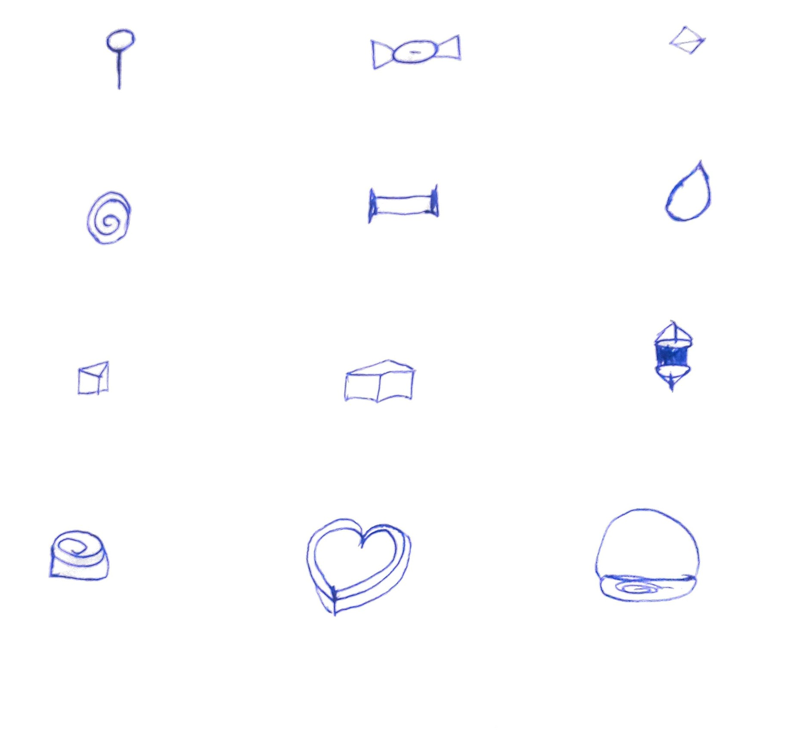
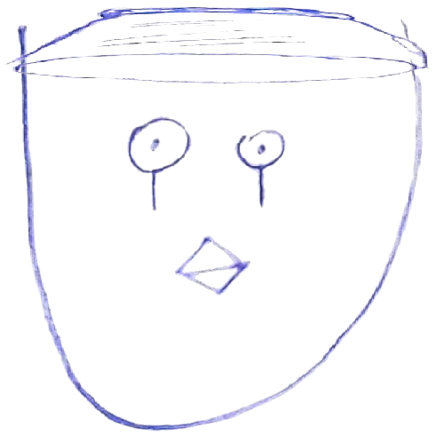

# Chocolate NFT Generator

As the NFT Trend is growing, so is the demand for NFTs. I just wanted to see how it works and I decided to create a NFT Generator. I needed a theme for the NFTs, so I asked my litte sister to say a word immediately, She said "chocolate" and the theme was ready. I looked into many generators and I found a lot of them and I am not interested in wasting money, so I decided to create my own. I am a terrible artist, anyway there is not other choice. I took a paper and pen and started to draw different layers of the NFTS.

### Face

### Eyes

### Hats

### Lips

>Not my Best Work..!

Anyways, I converted the paper work to digital seperate layers. Then I combined them using PILLOW and rendered them as a base64 to avoid storing at the server. The First NFT mited is here:

> Adorable...!

Finally I started minting using a simple interface.

